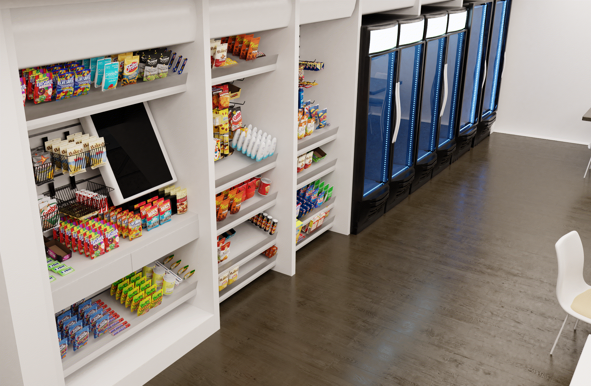
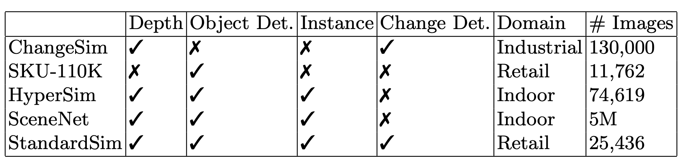

# StandardSim
StandardSim is a photorealistic synthetic dataset for retail environments

Project Page: https://standard-ai.github.io/Standard-Sim/

ICIAP 2022 Paper: https://arxiv.org/abs/2202.02418

Data: https://drive.google.com/drive/folders/1KRjuL1wxe2VqYKKIOAKa0-FXjTNgr4TX

Code for training models coming soon.

## Change Detection:

## Dataset Comparison

Shield: [![CC BY-NC-SA 4.0][cc-by-nc-sa-shield]][cc-by-nc-sa]

This work is licensed under a
[Creative Commons Attribution-NonCommercial-ShareAlike 4.0 International License][cc-by-nc-sa].

[![CC BY-NC-SA 4.0][cc-by-nc-sa-image]][cc-by-nc-sa]

[cc-by-nc-sa]: http://creativecommons.org/licenses/by-nc-sa/4.0/
[cc-by-nc-sa-image]: https://licensebuttons.net/l/by-nc-sa/4.0/88x31.png
[cc-by-nc-sa-shield]: https://img.shields.io/badge/License-CC%20BY--NC--SA%204.0-lightgrey.svg
